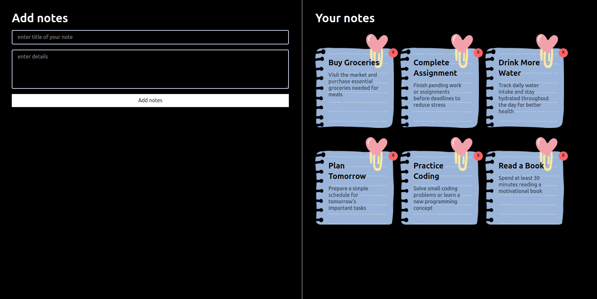

# Notes App UI

A simple and responsive Notes Application built using React and Tailwind CSS.  
Users can add notes, manage form inputs with two-way binding, and delete notes dynamically.

---

## Concepts Practiced

- React Components
- useState Hook
- Two Way Binding
- Form Handling
- Array Mapping
- Event Handling
- State Management
- Array Splice Method
- Conditional Rendering
- Tailwind CSS
- Flexbox
- Responsive Design

---

## Features

- Add Notes
- Delete Notes
- Dynamic UI Rendering
- Responsive Layout
- Controlled Inputs
- Sticky Notes Design

---

## Screenshot

  

---

## Tech Stack

- React JS
- Tailwind CSS
- JavaScript (ES6)

---

